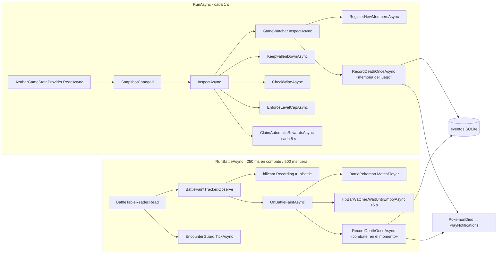

# Flujos del vigilante

Todo sale de **`src/PermaLocke.App/Services/GameLinkMonitor.cs`**, un solo vigilante con **dos bucles**, arrancado por `Start()` desde `App.OnStartup` (nunca con `--sin-juego`). Detalle de memoria en [[GameLink y memoria]].

## 1. Ciclo de un segundo (`RunAsync`)
- `provider.TrainerName = run.PlayerName`, y después `provider.ReadAsync()` devuelve un `GameSnapshot` con Connected, Problem, Party y la nota del entrenador.
- En el log solo quedan las **transiciones** entre conectado y desconectado.
- **Paso de conectado a desconectado:** llama a `MarkFallenAsync()`, que ejecuta `MaintenanceService.EnforceDeathsAsync`: deja a los caídos a 0 PS **en el fichero de partida** (la única ocasión de hacerlo es con el juego cerrado; §98 ter). Lanza `DeathMarked`.
- **`InspectAsync`** no hace nada si no hay conexión, si no hay run o **si todavía no hay Poké Balls** (`BallControlService.HasHadBallsAsync`, §149–150). Después, en este orden:
  1. `GameWatcher.InspectAsync` empareja el equipo con la run **solo por PID** (§56).
  2. `RegisterNewMembersAsync` registra por `EncounterService.RegisterAsync` con `EncounterType.Unknown` y `EventSource.AutoDetect`. Una captura que una regla bloquea no se fuerza (§68).
  3. Por cada caído ejecuta `RecordDeathOnceAsync(..., "memoria del juego")`.
  4. `KeepFallenDownAsync`: fuera de combate, a un caído con PS le escribe 0 PS en la estructura autoritativa (salto `0x1E4`, PS en `+0x158`), comprobando el PID en cada copia (§99, §135). Si no está en ninguna copia, ejecuta `provider.SweepAgain()`.
  5. `CheckWipeAsync`: flanco de equipo caído, `TeamWiped` (§36, §161).
  6. `EnforceLevelCapAsync`: baja la experiencia y el nivel de `0x1E4+0x158` y recalcula las estadísticas; relee antes de registrar `LevelCapEnforced`. `CapProblem` se enseña en rojo en HOME (§53, §154).
  7. `ClaimAutomaticRewardsAsync`, cada 5 s: los premios con `automatico` (§68).
  8. Si algo cambió, `RunDataChanged` y las pantallas se refrescan.

## 2. Bucle de combate (`RunBattleAsync`)
- `BattleTableReader.Read(now)`:
  - busca **un solo MB** (`0x30000000`) como mucho cada 3 s y solo fuera de combate;
  - durante un combate relee los bloques conocidos y no busca;
  - conserva el seguimiento durante 2 lecturas fallidas y recoloca a la 3ª (r3; ver [[Incidencias del PC del amigo]]).
- `BattleFaintTracker.Observe`:
  - una caída es cuando **las dos tablas** (la de cálculo y la de la barra) llegan a 0 **después de haberlo visto en pie**;
  - un combate está en curso cuando al menos dos tablas tienen rival;
  - cada posición se informa una vez.
- `killcam.Recording = _faints.InBattle`: la killcam solo graba en combate.
- **`OnBattleFaintAsync`**:
  - un rival solo se apunta en el log;
  - para uno del jugador, lee el PK7 que hay detrás del bloque (`BattleTableReader.ReadPokemon`, puntero `+0x40`) y llama a **`BattlePokemon.MatchPlayer`**:
    - un PID validado por checksum y especie, único en el equipo, da el miembro;
    - identidades contradictorias no dan nada;
    - sin PK7, se acepta por posición solo si la especie es única en el equipo (r3);
  - espera a que la barra de PS se vea a cero en pantalla: `HpBarWatcher.WaitUntilEmptyAsync`, que lee píxeles de la ventana de Azahar con un **límite de 6 s** (§114 ter, §165);
  - `killcam.Mark()` y después `RecordDeathOnceAsync(..., "combate, en el momento", rivales, mark)`.
- `EncounterGuard.TickAsync(run, tables, faints, InBattle)` es la regla de primer encuentro y la marca del MAPA. Si falla, solo se registra un aviso: nunca tumba la detección de muertes.

## 3. Registrar una muerte (`RecordDeathOnceAsync`)
- Antes de la primera ball no cuenta.
- `_deathGate`, un semáforo, evita que los dos bucles cobren la misma muerte: dentro de él se vuelve a mirar si sigue viva en la run (`maintenance.AliveAsync`).
- Toma el nombre y el nivel **actuales** del juego.
- `GameWatcher.RecordDeathAsync` registra `PokemonDied` con la penalización que multiplica el rol.
- `SaveKillcamAsync`, sin esperar: `KillcamRecorder.SaveAsync(KillcamClip.PathFor(Saves, run, pokemon), mark)`. Lo hace **quien gane la puerta**, así que el ciclo del equipo también guarda la killcam (arreglo del 20/09). Al acabar de escribir, `RunDataChanged` refresca el cementerio.
- Por último lanza `PokemonDied`.

## 4. Killcam (`App/Services/KillcamRecorder.cs`, `KillcamFrameBuffer.cs`, `KillcamClip.cs`)
- Graba la pantalla de arriba de Azahar copiando la ventana, **solo mientras `Recording`** (en combate).
- Anillo reutilizado de 141 fotogramas. Guarda **−4,5 s / +1,3 s** alrededor de la marca y conserva 7 s.
- Descarta fotogramas con otra ventana encima, porque copiar la pantalla copia lo que haya delante.
- Deja de grabar mientras sale la escena de muerte (§115).
- Reproducción en `Views/KillcamPlayer.cs`, dentro de CEMENTERIO.
- **Una killcam que no se grabó no se puede reconstruir.**

## 5. Encuentros por ruta (`App/Services/EncounterGuard.cs`, `GameLink/Field/*`)
- **Fuera de combate** (`OverworldTickAsync`): lee la zona con `FieldZoneReader.CurrentZone()`. Con la regla de balls activa y la ruta gastada, **retira las Poké Balls** a través de `BallControlService`, que deja un evento por paso y las devuelve después.
- **Detección de combate salvaje:** sube el récord 4, combates salvajes (`BattleCounterReader`, `IBattleCounters`).
  - `StartBattleAsync` toma la zona confirmada hace **5 s o menos** (`ZoneMaxAge`). Si no la hay, la lee al acabar.
  - Lee al rival en las tablas. `SpeciesDeadline` es de 8 s.
  - Decide con `EncounterPolicy`: variocolor, ruta gastada, duplicado de línea (`IEvolutionLineProvider`) o primer encuentro.
  - `SettleAsync`, al acabar: captura o huida por los récords, con `CountGrace` de 4 s; K.O. por las tablas. Marca el MAPA (`ZoneOutcomeSet`) y gasta la ruta (`ZoneEncounterSpent`).
- **Excepciones:**
  - zonas de prueba (`trialZones`: Cueva Sotobosque sala de la prueba, Colina Saltagua y Jungla Umbría): hasta tener el cristal Z, sin balls salvo un variocolor, y un combate no gasta la ruta (`TrialZoneService` → `EncounterSituation.PendingTrial`, §160 y §179);
  - las capturas estáticas permitidas (`WorldAllowedStatics`, `allowedStatics` en `rules.json`, §119);
  - fuera del MAPA no hay balls nunca.
- `EncounterGuard.Problem` es `counters.Problem ?? _zoneProblem`; `GameLinkMonitor.EncounterProblem` lo lleva a HOME, que dice por qué no se detectan encuentros.
- `Said` produce avisos como «te quitamos las balls» (`PlayNotifications`).

## 6. Avisos (`App/Services/PlayNotifications.cs` → `Notifier.cs`, `DeathCeremony.cs`)
| Evento | Qué sale |
|---|---|
| `BallControlService.FirstBallDetected`, solo tras guardar `FirstPokeBallSeen` | «¡Primeras Poké Balls!» |
| `EncounterGuard.Said` | aviso con el sprite de la especie o de la ball |
| `GameLinkMonitor.PokemonDied` | `DeathCeremony.Mourn` (ventana `DeathWindow` con la escena) + aviso «X ha caído −N puntos» |
| `MaintenanceService.MarkedDead` | solo la escena |
| `DeathMarked` | «Caídos» |
| `TeamWiped` | `ceremony.TeamFell` + aviso |
| `RewardGiven` | «Premio entregado» con el icono del objeto |

- `Notifier.Enabled`, `DeathCeremony.Enabled`, `KillcamRecorder.Enabled` y `EdgeTab.StepAside` los fija `AppSettings` desde CONFIGURACIÓN (`Config/ajustes.json`, §177).
- Coloca la ventana con `SetWindowPos` en coordenadas nativas dentro del monitor del juego (arreglo del 20/09 para escalas distintas de 100 %).
- Los errores de UI se capturan dentro de `Notifier` y no llegan al vigilante.
- Probar: CONFIGURACIÓN, botón «VER UN AVISO».
- La primera ball se anuncia una vez por run. El primer encuentro, una vez por ruta.

## 7. Sprites (`App/Services/PokemonSpriteService.cs`)
- Se extraen de la **ROM del jugador** y de la expansión en la primera pantalla que los pide (`PrepareAsync`). Van a `Data/sprites/v2/<sourceKey>/`, con la clave separada por ROM y expansión.
- Iconos: `a/0/6/2`, RGBA5551. La tabla especie→icono se hizo a mano (§30, §30 bis, §88). Gen 8-9 añade de 1154 a 1371 en orden nacional.
- `Get(species, form)`, `GetItem`, `GetBall`, `GetEgg`, `GetCategory`.
- Reintenta si antes faltaba la ROM. No memoriza las imágenes nulas.
- Causa típica de huecos: no hay ROM, o la expansión está vacía (le pasó a la copia aislada el 2026-09-23).

## 8. Cierre del emulador y diagnóstico
- `EmulatorLauncher` (1 Hz) vigila el proceso aunque se abra a mano.
- Si Azahar muere sin que nadie lo cierre, `EmulatorCrashReport` escribe `Diagnosticos/cierre-azahar-<fecha>.zip`, con el código de salida, el PC, los logs y las **últimas 128 peticiones RPC** (`AzaharRpcClient.Trace`, `RpcTrace`) (§168).
- A mano: `RECOGER DIAGNOSTICO.cmd` en la carpeta publicada, que ejecuta `tools/recoger-diagnostico.ps1`. Recoge logs, versión, CPU, RAM, GPU, ajustes y los errores de Windows de Azahar y de PermaLocke, sin ROM ni saves, y no envía nada.
